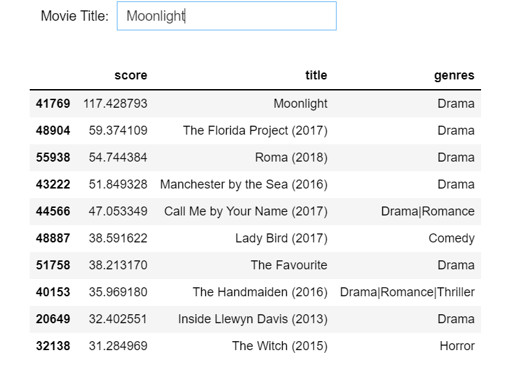

# A Movie 🎬🍿 Recommendation system built using Jupyter notebook, Python and Pandas

### Used Python and Pandas to create a scoring system that displays movie commendations based on comparable users. Used the 25m dataset provided by the Movie Lens (https://files.grouplens.org/datasets/movielens/ml-25m.zip) and the Ipywidgets library. The solution first finds the Term Frequency and Inverse document frequency (TFIDF) matrix using scikit-learn. It then compares the searched movie title to available titles using Cosine distance based collaborative filtering. Lastly, it finds similar users who liked the same movie and presents the top-10 results.

